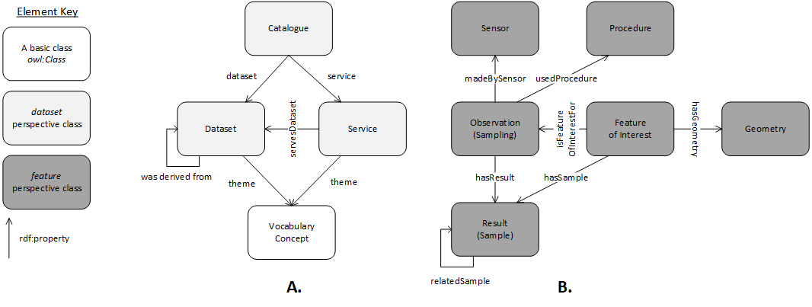

# GSQ's Information Model
> NOTE: Please read the [wiki](https://github.com/geological-survey-of-queensland/gsq-info-model/wiki) for background information.

This repository will contain the developing overarching information model for the Geological Survey of Queensland (GSQ)'s data.

This repository currently contains no substantive information.

While this Information Model is beling developed, see the specialised models that will eventually constitute it:

* [Borehole](https://github.com/geological-survey-of-queensland/gsq-borehole-profile)
* [Dataset](https://github.com/geological-survey-of-queensland/gsq-dataset-profile)
* [Industry Report](https://github.com/geological-survey-of-queensland/industry-report-profile)
* [Organisation](https://github.com/geological-survey-of-queensland/gsq-organisation-profile)
* [Permit](https://github.com/geological-survey-of-queensland/gsq-permit-profile)
* [Sample](https://github.com/geological-survey-of-queensland/gsq-sample-profile)
* [Survey](https://github.com/geological-survey-of-queensland/gsq-survey-profile/tree/master)

## Overarching model
This GSQ model uses a pair of top-level *perspectives* to describe all GSQ data: *dataset* & *feature*. Major classes of item and relationships between them within the perspectives are given in Figure 1.

  
**Figure 1**: Major classes and relationships within the A. Dataset and B. Feature perspectives of this model. The Dataset perspective is essentially the main classes of the [revised Data Catalogue Vocabulary (DCAT) ontology](https://www.w3.org/TR/vocab-dcat-2/) and the Feature perspective is essentially the main classes of the [revised Sensor, Observation, Sample, and Actuator (SOSA) segment of the SSN ontology](https://www.w3.org/TR/vocab-ssn/).

## Related models
This information models draws on previous work by this author to create overarching information models for other systems. Some of those previous models are:

* **[FSDF Ontology](https://github.com/geoscienceaustralia/fsdf-ont)** - the Foundational Spatial Data Framework ontology
  * created for Geoscience Australia in early 2018, this model describes "data class-level relationships between Semantic Web versions of ...[FSDF] datasets". 
  * the FSDF is made of many datasets and this ontology relates a series of them
  * this model is a precursor to the LocI overaching information model
* **LocI (Location Spine)** overarching information model  
  * *to be linked to as not yet public*
  * this model overviews multiple component dataset models and joining Linkset models creating a 'spine' of australian national spatial data
  * component models for LocI include:
    * Australian Statistical Geography Standard (ASGS) ontology - <http://linked.data.gov.au/def/asgs>
    * Australian Hydrological Geospatial Fabric (Geofabric) ontology - <http://linked.data.gov.au/def/geofabric>
    * Geocoded National Address File (G-NAF) ontology - <http://linked.data.gov.au/def/gnaf>
* **Longitudinal Spine of Government Functions** overarching information model
  * *to be linked to as not yet public*
  * this model overviews multiple component dataset models and joining Linkset models creating a 'spine' of structural and functional (Federal) government datasets to which many other datasets can be associated
* **EUDM overarching information model**
  * *available on request*
  * component models of this model are publis, such as the the Energy Use Data Model project's *profile* of the Dataset Catalogue Vocabulary (DCAT) model: [EUDM Profile](https://github.com/CSIRO-enviro-informatics/eudm-profile)

## Contacts
*owner*:  
**Geological Survey of Queensland**  
1 William St, Brisbane, Queensland, Australia  

*author*:  
**Nicholas Car**  
*Data Systems Architect*  
SURROUND Australia Pty Ltd  
<nicholas.car@surroundaustralia.com>  
